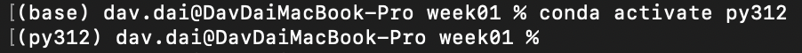
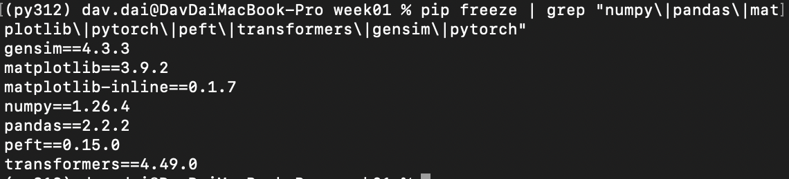

1.软件安装
Anaconda安装： env-anaconda安装
作用： 用于创建深度学习环境，以及对python编程的支持
Pycharm安装： env-pycharm安装
作用： 用于编写python代码，运行课程中的代码
2.深度学习环境配置
anaconda创建py环境： env-conda创建管理py环境
打开cmd，进入（激活）需要的py环境：conda activate 环境名
以py312环境为例：conda activate py312

Numpy安装

作用： 用于科学计算，提供了高性能的多维数组对象和丰富的数学函数
命令： pip install numpy==1.26.4 -i https://pypi.tuna.tsinghua.edu.cn/simple 
当使用清华源下载失败时，可尝试更换为阿里源
清华源： https://pypi.tuna.tsinghua.edu.cn/simple
阿里源： https://mirrors.aliyun.com/pypi/simple

Pandas安装

作用： 用于数据分析，提供了灵活的数据结构（如DataFrame），使数据清洗和分析变得简单高效
命令： pip install pandas==2.2.2 -i https://pypi.tuna.tsinghua.edu.cn/simple
Matplotlib安装

作用： 用于数据可视化，能够创建静态、动态和交互式图表
命令 ：pip install matplotlib==3.9.2 -i https://pypi.tuna.tsinghua.edu.cn/simple
Pytorch安装

作用： 深度学习领域的顶级框架，提供了构建和训练神经网络的工具
安装文档： env-pytorch安装
Gensim安装

作用： 用于主题建模和文本相似性计算
安装文档： env-gensim安装
Scikit-learn安装

作用： 提供了简单高效的数据挖掘和数据分析工具，支持多种机器学习算法
命令： pip install Scikit-learn==1.5.1 -i https://pypi.tuna.tsinghua.edu.cn/simple
Peft安装：

作用： 模型微调
命令： pip install peft==0.15.0 -i https://pypi.tuna.tsinghua.edu.cn/simple
transformers安装：

作用： 通过自注意力机制和位置编码，实现对序列数据的高效处理
命令： pip install transformers==4.55.0 -i https://pypi.tuna.tsinghua.edu.cn/simple
Pycharm中配置conda环境

安装文档：env-pycharm中配置conda环境
完成以上步骤之后，基础学习环境搭建完成，后续其他需要的库，根据课程进度安装！

安装完成，可以通过以下代码测试安装是否成功：

